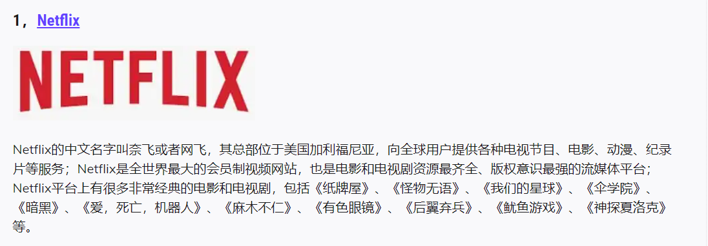

# 快速开始科学上网

## 1、快速开始使用

下载客户端吗，我这里推荐SS小火箭（shadowsocks），配置订阅链接，搞定！！！！  就这么简单。

**工具在哪里下？**

来，我帮你提前整理好了：

链接：https://pan.baidu.com/s/1Ryx9EKEqOe2Th3lUIYSxtg 
提取码：v12e 
--来自百度网盘超级会员V4的分享

**订阅链接哪里有？**

好吧，我给你一个：

https://andy.otelli.xyz/api/v1/client/subscribe?token=90d2526059fb06529d8702667a5ef25e

注意：链接经常会进行更换，如果发现无法访问，请联系客服获取新的订阅链接！

**如何获取免费订阅节点？**

添加客服，不定期的分享免费节点，分享福利好资源

+ Telegram：https://t.me/gaojishe

+ 微信：ban_ban__jun
+ QQ：2468214679

|                                                              |                                                              |
| ------------------------------------------------------------ | ------------------------------------------------------------ |
|  |  |

**升级VIP节点**

+ VIP节点的服务器和IP都是经过严格测试和检测的，保证节点的稳定性；**更快**
+ VIP节点会严格控制节点访问人数，拥有更多的节点服务器，避免拥塞；**更稳定**
+ VIP节点会采用更严格高效的加密算法，无法被有效追踪；**更安全**

**超值套餐**

+ VIP节点 + 常用成品号 + AI 教程  XXX

## 2、Shadowsocks （小火箭）

### 2.1 shadowsocks -windows

+ **github：**https://github.com/shadowsocks/shadowsocks-windows/releases

+ **使用说明**

  > 直接看图，一眼就明白了

|  |  |  |
| ------------------------------------------------------------ | ------------------------------------------------------------ | ------------------------------------------------------------ |
|  |  |                                                              |
|                                                              |                                                              |                                                              |

### 2.2 shadowsocks -mac

+ **github：**https://github.com/shadowsocks/ShadowsocksX-NG/releases

### 2.3 shadowsocks -android

+ **github：**https://github.com/shadowsocks/shadowsocks-android/releases
+ **使用说明**

**好了，到这里，你已经可以进行科学上网了**

## 3 Clash 

+ macOS, Linux, Windows

**github:**  https://github.com/clash-verge-rev/clash-verge-rev/releases

+ android

**github:**  https://github.com/ccg2018/ClashA/releases

|                                                              |                                                              |
| ------------------------------------------------------------ | ------------------------------------------------------------ |
|  |  |

下列教程中截图版本略有差异

### 3.1 Clash PC端 :  

|  |  |
| ------------------------------------------------------------ | ------------------------------------------------------------ |
|  |  |

### 3.2 Clash IOS/Android : 

|  |  |
| ------------------------------------------------------------ | ------------------------------------------------------------ |
|  |  |
|  |  |
|  |  |

## 4、V2Ray 

### 4.1 V2Ray PC端 :

**github：**https://github.com/v2fly/v2ray-core/releases 

### 4.2 V2Ray IOS/Android:

## 5 、走进科学

热门站点推荐：

https://qianghub.com/what-to-do-after-bypass-gfw/

### **各平台注册限制不同：**需要平台账号的，可以联系客服获取

## 6 联系客服，海量专业资料，各种成品号，应用尽有

+ 成品号:

> Telegram、Potato、QQ、蝙蝠、抖音、快手、淘宝、京东、百度贴吧、百家号，百度ck小号，微博ck小号，哔哩哔哩小号，Soul，陌陌、滴滴、微博、小红书、知乎、积目、美团、闲鱼、探探等

+ 稳定高速节点

> 热门区域：香港，美国，日本，德国，韩国，新加坡，台湾，解锁GPT, 流媒体
>
> Tiktok，亚马逊，专用节点，高纯IP

|        |        |
| --------------------------- | ----------------------- |
|  |  |

